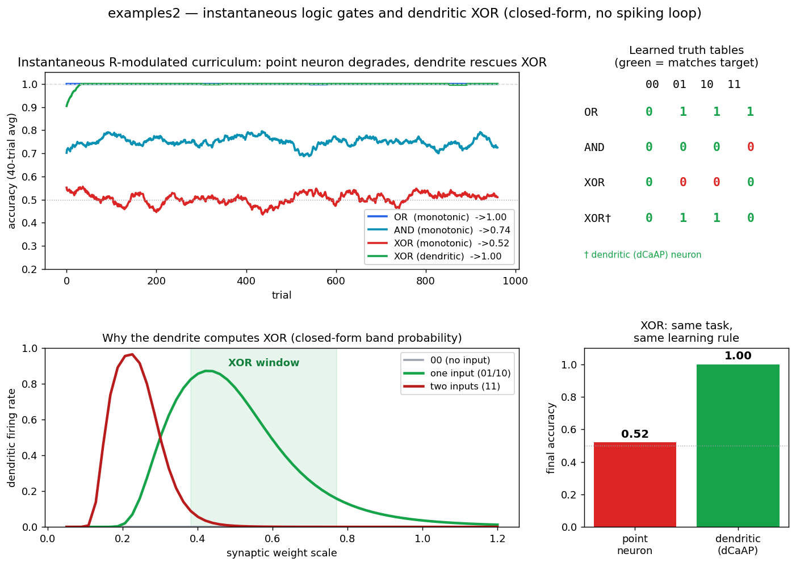
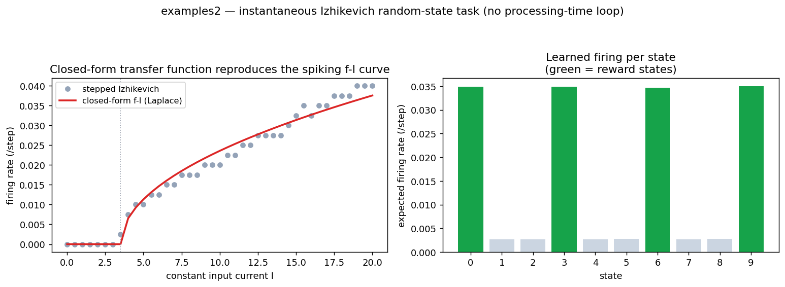

# examples2 — instantaneous (closed-form / Laplace) reproductions

The experiments in `examples/` are **spiking** simulations: every trial advances
each neuron through `processing_time` (P) micro-steps, re-injecting the previous
step's spikes and re-running reward-modulated STDP over a `stdp_window`. That
inner loop is an O(P·window) Monte-Carlo estimate of just two quantities — *how
often the neuron fires* and *how its inputs co-fire with it*.

`examples2/` computes those two quantities **in closed form**, so a trial costs
O(1) and the network runs like an ordinary feed-forward layer. Same tasks, same
conclusions, no inner time loop.

```bash
python -m examples2.logic_gates     # curriculum + 9 validation checks
python -m examples2.izhikevich      # f-I match + discrimination + speed demo
```

Both scripts also expose `make_figure(...)`:




## The idea, in three steps

A trial reduces to algebra over the **moments** of the input, propagated through
each neuron's **transfer function**:

```
pre-rate ──▶ (mean, var) of drive ──▶ firing rate f ──▶ realised rate ──▶ reward ──▶ ΔW
            input_moments()          closed-form f-I    one Gaussian draw          rate-Hebbian
```

### 1. Moment propagation (the feed-forward sum)

Input *i* fires independently with probability `rate_i` each step, so the summed
drive `I = gain·Σ_i s_i w_i` is, by the central limit theorem, approximately
Gaussian with

$$\mu = g\sum_i r_i w_i, \qquad \sigma^2 = g^2\sum_i r_i(1-r_i)\,w_i^2.$$

`transfer.input_moments` returns exactly these two numbers — one `einsum`, no
sampling. This is the rate-model / mean-field reduction of the spiking input.

### 2. The transfer function (the Laplace step)

A leaky integrator is a first-order linear filter,

$$\tau\,\dot v = -v + I(t)\quad\Longleftrightarrow\quad V(s)=H(s)I(s),\;\; H(s)=\frac{1}{\tau s+1},$$

and the discrete leaky neuron the spiking engine uses, $v_{t+1}=(1-d)\,v_t+I$, is
the same system sampled in time, with $H(z)=1/(1-(1-d)z^{-1})$ and DC gain
$H(0)=1/d$. Solving the recurrence from reset gives the **exact** first
threshold-crossing time and hence a closed-form firing rate (the f-I curve):

| neuron | `transfer` fn | closed form |
|---|---|---|
| **LIF** (monotonic point neuron) | `lif_rate` | rheobase $=\theta d$; rate $=1/t^\*$, $t^\*=\dfrac{\ln(1-\theta d/I)}{\ln(1-d)}$ |
| **dCaAP** (dendritic, non-monotonic) | `band_rate` | $P(\text{lo}\le I\le\text{hi})=\Phi\!\big(\tfrac{\text{hi}-\mu}{\sigma}\big)-\Phi\!\big(\tfrac{\text{lo}-\mu}{\sigma}\big)$ |
| **Izhikevich** (regular spiking) | `izhi_rate` | type-I onset $f=k\sqrt{I-I_\text{rh}}$, with $k,I_\text{rh}$ calibrated once against the real neuron |

When the mean drive sits near the rheobase (the Izhikevich task), the neuron still
fires on the upper tail of the input fluctuations, so we use the **noise-aware**
expectation $\mathbb{E}_{I\sim\mathcal N(\mu,\sigma^2)}[f(I)]$ via 9-node
Gauss-Hermite quadrature (`transfer.expected_rate`) — the diffusion term of the
rate model. Still O(1); still no stepping.

### 3. Reward-modulated rate-Hebbian learning

The spiking rule sums, over the window, recency-weighted pre-spikes times the
post-spike, then scales by reward. In expectation over the rate-coded window that
collapses to the classic **rate limit of pair-STDP**:

$$\Delta W_{ij} = \eta\,\kappa\,r\;\langle\text{pre}_i\rangle\,\langle\text{post}_j\rangle,$$

a reward-gated outer product of input and output rates, clipped to
`[0, max_weight]` and kept feed-forward. The one constant that carries over from
the spiking engine is $\kappa$ = `elig_gain`: the closed-form magnitude of the
eligibility the spiking loop *accumulates* over its P-step, W-window inner pass,
whose mean-field value is $\approx P\cdot\text{window}/2$. That single scalar lets
an O(1) update stand in for the O(P·window) accumulation — and it is what puts the
monotonic AND learner into the same **silent / dead-start trap** the spiking neuron
falls into (a punished trial slams the weight to zero; at zero weight the neuron
can't fire, so it can't earn reward to recover).

A single random draw (`transfer.realize`) adds the trial-to-trial sampling
variance the spiking neuron would have had over P steps — supplying the
exploration noise reward-modulated learning needs — in one Gaussian sample instead
of P Bernoulli steps.

## What is reproduced

**Logic gates** (`logic_gates.py`) — the full curriculum, all 9 checks pass:

| stage | spiking `examples/` | instantaneous `examples2/` |
|---|---|---|
| OR (monotonic) | ~1.0 | **1.00** |
| AND (monotonic) | ~0.73 plateau | **0.74** plateau |
| XOR (monotonic) | ~0.5 wall | **0.52** wall |
| XOR (dendritic) | ~1.0 | **1.00** |

**Izhikevich random-state** (`izhikevich.py`) — all 4 checks pass:

- the closed-form f-I curve matches the stepped Izhikevich neuron to
  `max|Δ| ≈ 0.004`;
- reward-modulated learning makes the neuron fire ~13× more for reward states
  than non-reward states, while the `lr=0` control shows no discrimination;
- ~5000 learner-trials/second, with the 100 micro-steps per trial **eliminated**.

## What stays the same vs. what changes

| | spiking `examples/` | instantaneous `examples2/` |
|---|---|---|
| inner P-step membrane loop | yes | **gone** (closed-form f-I) |
| STDP window loop | yes | **gone** (rate-Hebbian + `elig_gain`) |
| trial loop (learning) | yes | yes — learning is still iterative |
| batching over seeds (axis B) | yes | yes |
| exploration noise | sampled spikes | one Gaussian draw / trial |
| reward, encoding, weight clipping, feed-forward | identical | identical |

## Files

```
examples2/
  transfer.py    moment propagation + closed-form f-I curves + Gauss-Hermite
                 expectation + one-time Izhikevich calibration  (the Laplace core)
  engine.py      run_instant: trial loop only, each trial O(1)
  spec.py        presets (numeric values inherited from examples/), expand(),
                 elig_gain = P*window/2
  logic_gates.py instantaneous curriculum + dendritic XOR + validate + figure
  izhikevich.py  instantaneous random-state task + f-I check + validate + figure
```

The only time loop anywhere in `examples2/` is the one-time `calibrate_izhi`
sweep that fits two constants of the Izhikevich f-I curve; the learning path never
steps in time.
